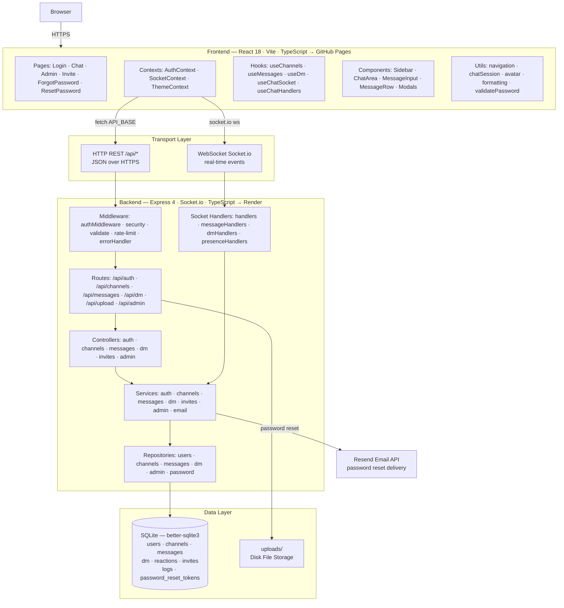

# Instant Messenger

**Live Demo:** https://DimitarDTsonev.github.io/Instant_Messenger/

> The backend runs on Render's free tier, which sleeps after inactivity. The first request (e.g. login) may take 30–60 seconds while the server wakes up — this is expected, not a bug.

Instant Messenger is a fullstack real-time chat application built with TypeScript, React, Vite, Node.js, Express, Socket.io, and SQLite. It supports account registration, guest login, JWT authentication, public and private channels, channel roles and permissions, direct messages, message search, file uploads, replies, reactions, pins, mentions, browser notifications, online presence, admin moderation, security logging, password reset, and an authenticated webhook used by the companion Music Dashboard application.

This README is intentionally detailed. It explains how the application is structured, how data moves through it, where each feature lives, how security is enforced, how tests are organized, and how the backend, frontend, database, sockets, middleware, controllers, services, repositories, CI/CD, and external integrations connect.

## Table Of Contents

* [What The App Does](#what-the-app-does)

* [Tech Stack](#tech-stack)

* [Runtime Architecture](#runtime-architecture)

* [Repository Structure](#repository-structure)

* [Local Development](#local-development)

* [Environment Variables](#environment-variables)

* [Backend Architecture](#backend-architecture)

* [Frontend Architecture](#frontend-architecture)

* [Database Model](#database-model)

* [Authentication And Authorization](#authentication-and-authorization)

* [Channel Flow](#channel-flow)

* [Direct Message Flow](#direct-message-flow)

* [Socket.io Events](#socketio-events)

* [REST API Reference](#rest-api-reference)

* [File Uploads](#file-uploads)

* [Invites](#invites)

* [Search](#search)

* [Admin And Security](#admin-and-security)

* [Password Reset](#password-reset)

* [Music Dashboard Integration](#music-dashboard-integration)

* [Testing](#testing)

* [CI/CD And Deployment](#cicd-and-deployment)

* [Configuration Files](#configuration-files)

* [Operational Notes](#operational-notes)

## What The App Does

Instant Messenger is organized around two communication surfaces:

* Channels: shared rooms that can be public or private. Channel membership can be managed and every channel member has a channel role.

* Direct messages: one-to-one conversations between users, delivered through personal notification rooms.

The app uses REST for durable reads and administrative operations, and Socket.io for live write operations. This split keeps initial page loads and history pagination simple while keeping message creation, edits, deletion, reactions, typing, reads, pins, notifications, and presence real time.

Important product features:

* Account registration and login.

* Guest accounts for temporary access.

* JWT-based authenticated API and Socket.io connections.

* First registered user becomes a global admin.

* Public and private channels.

* Channel roles: `owner`, `manager`, `member`, `viewer`.

* Per-channel permission sets for non-owner roles.

* Channel member management.

* Invite links with optional expiry and maximum use count.

* Channel messages with replies, edits, deletes, reactions, pins, file attachments, and mentions.

* Direct messages with replies, edits, deletes, reactions, read receipts, typing indicators, and file attachments.

* Message search across accessible channels and DMs.

* Per-channel search.

* Pinned message banner.

* Online presence and status values: `online`, `away`, `dnd`.

* Browser notification support for mentions.

* Web Audio notification sound for background notifications.

* Admin user list, account ban and unban, and security log viewer.

* Password reset through Resend when configured, with console fallback when not configured.

* Authenticated webhook for external applications, used by Music Dashboard.

* Service worker for basic PWA shell caching.

## Tech Stack

| Layer      | Technology                     | Purpose                                                      |
| ---------- | ------------------------------ | ------------------------------------------------------------ |
| Frontend   | React 18                       | Component-based UI                                           |
| Frontend   | TypeScript                     | Static typing across UI, hooks, contexts, and tests          |
| Frontend   | Vite                           | Development server, production build, GitHub Pages base path |
| Frontend   | Socket.io Client               | Real-time connection to the backend                          |
| Frontend   | Vitest, Testing Library, jsdom | Unit and component tests                                     |
| Backend    | Node.js 22                     | Runtime                                                      |
| Backend    | Express 4                      | REST API, middleware chain, static upload serving            |
| Backend    | TypeScript                     | Typed backend modules                                        |
| Backend    | Socket.io                      | WebSocket-style real-time events                             |
| Backend    | better-sqlite3                 | Synchronous SQLite database access                           |
| Backend    | Zod                            | Request body validation                                      |
| Backend    | JWT                            | Stateless auth token format                                  |
| Backend    | bcryptjs                       | Password hashing                                             |
| Backend    | helmet                         | Security-related HTTP headers                                |
| Backend    | cors                           | Browser cross-origin access control                          |
| Backend    | express-rate-limit             | Global and auth-specific request limits                      |
| Backend    | multer                         | Multipart file upload handling                               |
| Backend    | Resend                         | Optional password reset email delivery                       |
| Backend    | Jest, Supertest, ts-jest       | API, service, middleware, and socket tests                   |
| Deployment | GitHub Actions                 | CI, coverage artifacts, CodeQL, frontend deployment          |
| Deployment | GitHub Pages                   | Static frontend hosting                                      |
| Deployment | Render                         | Backend hosting                                              |
| Deployment | Docker, Compose, nginx         | Containerized local or production-like deployment            |

## Architecture Diagrams

### Layer Architecture

The diagram below shows how the application is organized into layers and how each layer connects to the next, from the browser down to the database.



**How to read this diagram:**

* The **Frontend** layer runs entirely in the browser. `AuthContext` owns the JWT and wraps every REST call. `SocketContext` manages the Socket.io connection used for real-time events.

* **Transport** splits cleanly: durable reads (channel history, user lists, search) use REST; live writes (messages, reactions, typing, presence) use Socket.io.

* The **Backend** follows a strict `Route → Controller → Service → Repository` chain. Each layer has one job: routes own HTTP shape, controllers parse params, services apply business rules, repositories run SQL.

* **Socket Handlers** live beside the route chain and call the same services, so real-time writes go through the same business logic as REST writes.

* Everything that needs persistence hits **SQLite** through a repository. The database singleton is initialized once on startup with WAL mode and auto-migrations.

***

### Interactive File Graph

An interactive graph of every source file and its import connections is available at:

**[`frontend/public/architecture.html`](frontend/public/architecture.html)**

After deployment to GitHub Pages it is also reachable at the `/architecture.html` path of the frontend URL. To use it locally, open the file directly in a browser — no build step needed.

**Features:**

* **Zoom** — scroll wheel or pinch to zoom in and read individual file labels

* **Pan** — click and drag the background to move around

* **Drag nodes** — rearrange any node to explore connections

* **Filter by layer** — click a layer button (Pages, Hooks, Services, etc.) to isolate that group

* **Search** — type a filename or keyword to highlight matching nodes

* **Click a node** — see the file path, description, and every connected file in the side panel

* **Click a connected file tag** — jump directly to that node in the graph

* **Physics toggle** — re-run the force-directed layout at any time

* **Fit View** — reset the viewport to show all nodes

The graph contains all **frontend and backend source files** (excluding tests and build output) and draws edges for every significant import relationship between them.

***

## Runtime Architecture

```text
Browser
  -> React application
  -> AuthContext stores token and user in localStorage
  -> REST calls use API_BASE from frontend/src/config.ts
  -> SocketProvider connects to SOCKET_URL with socket.handshake.auth.token

Backend HTTP server
  -> Express middleware: uploads static route, helmet, trust proxy, CORS, banned IP check, rate limits, JSON parsing
  -> REST routers under /api/*
  -> global error handler
  -> Socket.io server sharing the same Node HTTP server

Database and files
  -> better-sqlite3 singleton from src/db/database.ts
  -> SQLite tables created and migrated by initDatabase()
  -> uploads/ directory served at /uploads/*
```

The key backend wiring is in `backend/server.ts`:

```ts
app.use("/api/auth", authRoutes);
app.use("/api/channels", channelRoutes);
app.use("/api/messages", messageRoutes);
app.use("/api/dm", dmRoutes);
app.use("/api/upload", uploadRoutes);
app.use("/api/invite", inviteRoutes);
app.use("/api/admin", adminRoutes);
app.use("/api/integrations", createIntegrationsRouter(io));
registerSocketHandlers(io);
```

The frontend reads runtime connection settings from `frontend/src/config.ts`:

```ts
export const API_BASE = import.meta.env.VITE_API_URL ?? "http://localhost:4000/api";
export const SOCKET_URL = import.meta.env.VITE_SOCKET_URL ?? "http://localhost:4000";
```

## Repository Structure

```text
instant-messenger/
|-- README.md
|-- docker-compose.yml
|-- render.yaml
|-- .dockerignore
|-- uploads/
|-- .github/
|   `-- workflows/
|       |-- ci.yml
|       |-- codeql.yml
|       `-- deploy.yml
|-- backend/
|   |-- Dockerfile
|   |-- package.json
|   |-- tsconfig.json
|   |-- tsconfig.test.json
|   |-- jest.config.ts
|   |-- server.ts
|   |-- .env.example
|   `-- src/
|       |-- controllers/
|       |   |-- admin.controller.ts
|       |   |-- auth.controller.ts
|       |   |-- channels.controller.ts
|       |   |-- dm.controller.ts
|       |   |-- invites.controller.ts
|       |   `-- messages.controller.ts
|       |-- db/
|       |   |-- database.ts
|       |   `-- seed.ts
|       |-- middleware/
|       |   |-- auth.ts
|       |   |-- errorHandler.ts
|       |   |-- security.ts
|       |   `-- validate.ts
|       |-- repositories/
|       |   |-- admin.repository.ts
|       |   |-- channels.repository.ts
|       |   |-- dm.repository.ts
|       |   |-- messages.repository.ts
|       |   |-- password.repository.ts
|       |   `-- users.repository.ts
|       |-- routes/
|       |   |-- admin.ts
|       |   |-- auth.ts
|       |   |-- channels/
|       |   |   |-- channelInvites.ts
|       |   |   |-- helpers.ts
|       |   |   |-- index.ts
|       |   |   |-- members.ts
|       |   |   `-- permissions.ts
|       |   |-- dm.ts
|       |   |-- integrations.ts
|       |   |-- invites.ts
|       |   |-- messages.ts
|       |   `-- upload.ts
|       |-- schemas/
|       |   |-- admin.schemas.ts
|       |   |-- auth.schemas.ts
|       |   `-- channel.schemas.ts
|       |-- services/
|       |   |-- admin.service.ts
|       |   |-- auth.service.ts
|       |   |-- channels.service.ts
|       |   |-- dm.service.ts
|       |   |-- email.service.ts
|       |   |-- invites.service.ts
|       |   `-- messages.service.ts
|       |-- socket/
|       |   |-- dmHandlers.ts
|       |   |-- handlers.ts
|       |   |-- messageHandlers.ts
|       |   |-- presenceHandlers.ts
|       |   `-- socketUtils.ts
|       |-- test-utils/
|       |   |-- createTestApp.ts
|       |   `-- createTestDb.ts
|       |-- utils/
|       |   `-- asyncRoute.ts
|       |-- bcryptjs.d.ts
|       |-- express.d.ts
|       |-- errors.ts
|       |-- types.ts
|       `-- __tests__/
|           |-- admin.test.ts
|           |-- auth.test.ts
|           |-- channels.test.ts
|           |-- dm.test.ts
|           |-- integrations.test.ts
|           |-- invites.test.ts
|           |-- messages.test.ts
|           |-- middleware.test.ts
|           |-- security.test.ts
|           |-- socket.test.ts
|           |-- upload.test.ts
|           `-- tsconfig.json
`-- frontend/
    |-- Dockerfile
    |-- nginx.conf
    |-- package.json
    |-- vite.config.ts
    |-- tsconfig.json
    |-- tsconfig.node.json
    |-- tsconfig.sw.json
    |-- index.html
    |-- .env.example
    |-- .env.development
    |-- public/
    |   |-- 404.html
    |   |-- icon.svg
    |   |-- manifest.json
    |   `-- sw.js
    `-- src/
        |-- App.tsx
        |-- main.tsx
        |-- config.ts
        |-- index.css
        |-- sw.ts
        |-- types.ts
        |-- vite-env.d.ts
        |-- context/
        |   |-- AuthContext.tsx
        |   |-- SocketContext.tsx
        |   |-- ThemeContext.tsx
        |   |-- socketEmitters.ts
        |   |-- socketHandlerRefs.ts
        |   `-- socketTypes.ts
        |-- hooks/
        |   |-- useApi.ts
        |   |-- useChannelMembers.ts
        |   |-- useChannelSettings.ts
        |   |-- useChannels.ts
        |   |-- useChatHandlers.ts
        |   |-- useChatSocket.ts
        |   |-- useDebounce.ts
        |   |-- useDm.ts
        |   |-- useMessages.ts
        |   |-- useSearch.ts
        |   `-- useUsers.ts
        |-- pages/
        |   |-- AdminPage.tsx
        |   |-- ChatPage.tsx
        |   |-- ForgotPasswordPage.tsx
        |   |-- InvitePage.tsx
        |   |-- LoginPage.tsx
        |   |-- ResetPasswordPage.tsx
        |   |-- adminStyles.ts
        |   `-- chatPageStyles.ts
        |-- components/
        |   |-- AdminLogsTable.tsx
        |   |-- AdminUsersTable.tsx
        |   |-- BanModal.tsx
        |   |-- ChannelSettingsModal.tsx
        |   |-- ChannelSettingsTabs.tsx
        |   |-- ChatArea.tsx
        |   |-- ChatTopbar.tsx
        |   |-- EmojiPicker.tsx
        |   |-- ErrorBoundary.tsx
        |   |-- FilePreviewModal.tsx
        |   |-- Icons.tsx
        |   |-- MarkdownRenderer.tsx
        |   |-- MentionDropdown.tsx
        |   |-- MessageInput.tsx
        |   |-- MessageRow.tsx
        |   |-- MusicMessagePreview.tsx
        |   |-- PinnedBanner.tsx
        |   |-- SearchModal.tsx
        |   |-- Sidebar.tsx
        |   |-- SidebarChannelList.tsx
        |   |-- SidebarDmList.tsx
        |   |-- TouchMenu.tsx
        |   |-- UserProfileModal.tsx
        |   |-- UserSearchModal.tsx
        |   |-- channelSettingsStyles.ts
        |   |-- chatAreaStyles.ts
        |   |-- messageInputStyles.ts
        |   `-- sidebarStyles.ts
        |-- utils/
        |   |-- avatar.ts
        |   |-- chatSession.ts
        |   |-- fileUtils.ts
        |   |-- messageFormatting.ts
        |   |-- navigation.ts
        |   |-- notificationSound.ts
        |   `-- validatePassword.ts
        |-- test-utils/
        |   |-- mocks.ts
        |   `-- setup.ts
        `-- __tests__/
            |-- App.test.tsx
            |-- components/
            |   |-- ChannelSettingsModal.test.tsx
            |   |-- ChatArea.test.tsx
            |   |-- ChatPage.test.tsx
            |   |-- ErrorBoundary.test.tsx
            |   |-- MarkdownRenderer.test.tsx
            |   |-- MessageInput.test.tsx
            |   |-- MusicMessagePreview.test.tsx
            |   |-- PinnedBanner.test.tsx
            |   |-- SearchModal.test.tsx
            |   |-- Sidebar.test.tsx
            |   |-- UserProfileModal.test.tsx
            |   `-- UserSearchModal.test.tsx
            |-- context/
            |   |-- AuthContext.test.tsx
            |   |-- SocketContext.test.tsx
            |   `-- ThemeContext.test.tsx
            |-- hooks/
            |   `-- useApi.test.ts
            |-- pages/
            |   |-- AdminPage.test.tsx
            |   |-- ForgotPasswordPage.test.tsx
            |   |-- InvitePage.test.tsx
            |   |-- LoginPage.test.tsx
            |   `-- ResetPasswordPage.test.tsx
            |-- utils/
            |   |-- navigation.test.ts
            |   `-- notificationSound.test.ts
            `-- tsconfig.json
```

## Local Development

### Prerequisites

* Node.js 22 or newer.

* npm 9 or newer.

* A shell that can run npm scripts.

### Backend Setup

```bash
cd backend
npm install
cp .env.example .env
npm run seed
npm run dev
```

The backend runs at `http://localhost:4000`.

`npm run dev` uses:

```bash
tsx watch --env-file=.env server.ts
```

That means local environment variables are loaded directly from `backend/.env`.

### Frontend Setup

```bash
cd frontend
npm install
cp .env.example .env.development
npm run dev
```

The frontend runs at `http://localhost:5173`.

`npm run dev` first type-checks and builds the service worker, then starts Vite:

```bash
npm run build:sw && vite
```

### Seeded Account

The seed script creates demo data for development. The commonly used demo account is:

```text
Email:    alice@demo.com
Password: Password@123
```

If you register into an empty database, the first registered user receives the global `admin` role.

## Environment Variables

### Backend

`backend/.env.example` documents backend runtime configuration:

```text
PORT=4000
JWT_SECRET=change-this-to-a-long-random-string
FRONTEND_URL=https://your-username.github.io
RESEND_API_KEY=re_xxxxxxxxxxxxxxxxxxxxxxxxxxxxxxxx
RESEND_FROM_EMAIL=onboarding@resend.dev
BOT_USERNAME=MusicBot
BOT_EMAIL=musicbot@dashboard.local
BOT_PASSWORD=MusicBot1!
```

Important backend variables:

* `PORT`: HTTP and Socket.io port. Defaults to `4000`.

* `JWT_SECRET`: required by `server.ts` before the backend starts. This must be long and private in production.

* `FRONTEND_URL`: used for CORS and password reset links.

* `DB_PATH`: optional SQLite database path. Docker sets this to `/app/data/messenger.db`.

* `RESEND_API_KEY`: optional. Enables real password reset emails.

* `RESEND_FROM_EMAIL`: optional sender address for reset emails.

* `BOT_USERNAME`, `BOT_EMAIL`, `BOT_PASSWORD`: optional system account used by external integrations. If email and password are set, `initDatabase()` creates the bot account if it does not already exist.

### Frontend

`frontend/.env.example` documents Vite variables:

```text
VITE_API_URL=https://your-backend.onrender.com/api
VITE_SOCKET_URL=https://your-backend.onrender.com
```

Important frontend variables:

* `VITE_API_URL`: REST API base URL. Local default is `http://localhost:4000/api`.

* `VITE_SOCKET_URL`: Socket.io server URL. Local default is `http://localhost:4000`.

* `VITE_BASE_PATH`: production base path used by Vite builds, especially for GitHub Pages.

## Backend Architecture

The backend follows a route -> controller -> service -> repository pattern.

```text
Express route
  -> optional validate(schema)
  -> authMiddleware when protected
  -> controller parses params/query/body at HTTP boundary
  -> service applies business rules and authorization
  -> repository runs SQL
  -> controller sends JSON response
  -> errorHandler formats thrown AppError objects
```

### Routes

Routes define URL shape, auth requirements, validation middleware, and controller mapping.

| File                                    | Mounted Path                    | Responsibility                                                                                  |
| --------------------------------------- | ------------------------------- | ----------------------------------------------------------------------------------------------- |
| `src/routes/auth.ts`                    | `/api/auth`                     | Register, guest login, login, password reset, current user, user list, user search, role update |
| `src/routes/channels/index.ts`          | `/api/channels`                 | Channel list/create/update/delete and sub-router mounting                                       |
| `src/routes/channels/members.ts`        | `/api/channels/:id/members`     | Channel member list/add/role update/remove                                                      |
| `src/routes/channels/permissions.ts`    | `/api/channels/:id/permissions` | Per-role permission read/update                                                                 |
| `src/routes/channels/channelInvites.ts` | `/api/channels/:id/invites`     | Channel invite create/list/revoke                                                               |
| `src/routes/messages.ts`                | `/api/messages`                 | Channel message history, pinned messages, global and channel search                             |
| `src/routes/dm.ts`                      | `/api/dm`                       | DM conversations, DM history, mark read                                                         |
| `src/routes/upload.ts`                  | `/api/upload`                   | Multipart upload endpoint                                                                       |
| `src/routes/invites.ts`                 | `/api/invite`                   | Public invite preview and authenticated join                                                    |
| `src/routes/admin.ts`                   | `/api/admin`                    | Admin user and security log operations                                                          |
| `src/routes/integrations.ts`            | `/api/integrations`             | Authenticated integration health and webhook                                                    |

### Controllers

Controllers keep HTTP concerns close to the route and delegate real work to services.

| File                     | Main Functions                                                                                                                     |
| ------------------------ | ---------------------------------------------------------------------------------------------------------------------------------- |
| `admin.controller.ts`    | `getUsers`, `getSecurityLogs`, `ban`, `unban`                                                                                      |
| `auth.controller.ts`     | `register`, `guest`, `login`, `me`, `listUsers`, `searchUsers`, `getUserById`, `updateUserRole`, `forgotPassword`, `resetPassword` |
| `channels.controller.ts` | `list`, `create`, `update`, `remove`, member operations, permission operations, invite operations                                  |
| `dm.controller.ts`       | `getConversations`, `getMessages`, `markRead`                                                                                      |
| `invites.controller.ts`  | `getInvite`, `joinInvite`                                                                                                          |
| `messages.controller.ts` | `getHistory`, `getPinned`, `searchAll`, `searchInChannel`                                                                          |

### Services

Services contain business rules and cross-repository decisions.

| File                  | Responsibility                                                                           |
| --------------------- | ---------------------------------------------------------------------------------------- |
| `admin.service.ts`    | Admin user listing, ban/unban safety checks, security log writes                         |
| `auth.service.ts`     | Password rules, registration, guest creation, login, role updates, password reset tokens |
| `channels.service.ts` | Channel visibility, creator ownership, role and permission enforcement, invite creation  |
| `dm.service.ts`       | Conversation list, paginated DM history, read receipt updates                            |
| `email.service.ts`    | Password reset email delivery through Resend or console fallback                         |
| `invites.service.ts`  | Invite lookup, expiry/use validation, join transaction                                   |
| `messages.service.ts` | Message history, pinned messages, global search, channel search                          |

### Repositories

Repositories isolate SQL and database row shaping.

| File                     | Responsibility                                                  |
| ------------------------ | --------------------------------------------------------------- |
| `admin.repository.ts`    | Admin-facing user and security log queries                      |
| `channels.repository.ts` | Channels, members, roles, permissions, invites                  |
| `dm.repository.ts`       | DM conversations, DM history, DM reactions, read updates        |
| `messages.repository.ts` | Channel messages, replies, reactions, pins, search              |
| `password.repository.ts` | Password reset token lookup/create/mark-used                    |
| `users.repository.ts`    | User lookup, creation, public projections, role and ban updates |

### Schemas

Zod schemas validate request bodies before controllers receive them.

| File                 | Schemas                                                                                                         |
| -------------------- | --------------------------------------------------------------------------------------------------------------- |
| `admin.schemas.ts`   | `BanSchema`                                                                                                     |
| `auth.schemas.ts`    | `RegisterSchema`, `LoginSchema`, `ForgotPasswordSchema`, `ResetPasswordSchema`, `UpdateRoleSchema`              |
| `channel.schemas.ts` | `CreateChannelSchema`, `UpdateChannelSchema`, `AddMemberSchema`, `UpdateMemberRoleSchema`, `CreateInviteSchema` |

The validation middleware replaces `req.body` with parsed Zod data:

```ts
router.post("/register", validate(RegisterSchema), AuthController.register);
```

### Middleware

| File              | Responsibility                                                                       |
| ----------------- | ------------------------------------------------------------------------------------ |
| `auth.ts`         | Bearer token validation, fresh user lookup, ban enforcement, JWT signing             |
| `validate.ts`     | Zod parsing and validation error conversion                                          |
| `security.ts`     | IP ban checks, login failure tracking, security event logging, socket flood tracking |
| `errorHandler.ts` | Converts known app errors and upload errors into structured JSON                     |

Custom errors live in `src/errors.ts`:

* `ValidationError`: 400

* `UnauthorizedError`: 401

* `ForbiddenError`: 403

* `NotFoundError`: 404

* `ConflictError`: 409

* `GoneError`: 410

Known errors return:

```json
{
  "error": "Human readable message",
  "code": "MACHINE_READABLE_CODE"
}
```

## Frontend Architecture

The frontend is a React SPA. It uses contexts for cross-cutting state, hooks for API and socket workflows, pages for route-level screens, components for reusable UI, and utility modules for formatting, navigation, validation, and notifications.

### App Shell

| File            | Responsibility                                                                   |
| --------------- | -------------------------------------------------------------------------------- |
| `src/main.tsx`  | Creates the React root and wraps app providers                                   |
| `src/App.tsx`   | Top-level routing between login, reset password, invite, admin, and chat screens |
| `src/config.ts` | Exports `API_BASE` and `SOCKET_URL` from Vite env vars                           |
| `src/index.css` | Global theme, responsive layout, touch menu styling                              |
| `src/sw.ts`     | Service worker app-shell caching                                                 |

### Contexts

| File                   | Responsibility                                                      |
| ---------------------- | ------------------------------------------------------------------- |
| `AuthContext.tsx`      | User/token state, register, login, logout, authenticated API helper |
| `SocketContext.tsx`    | Socket lifecycle, connection state, event listener wiring           |
| `socketEmitters.ts`    | Stable functions for every outbound socket event                    |
| `socketHandlerRefs.ts` | Stable refs so socket listeners always call the latest handlers     |
| `socketTypes.ts`       | Socket context types                                                |
| `ThemeContext.tsx`     | Light/dark/system theme state                                       |

The Socket.io client authenticates with the JWT during the handshake:

```ts
const socket = io(SOCKET_URL, {
  auth: { token },
  transports: ["websocket", "polling"],
});
```

### Hooks

| File                    | Responsibility                                                  |
| ----------------------- | --------------------------------------------------------------- |
| `useChannels.ts`        | Load and create channels                                        |
| `useMessages.ts`        | Channel history and pinned message loading                      |
| `useDm.ts`              | DM history and conversation list                                |
| `useUsers.ts`           | User list and user search                                       |
| `useSearch.ts`          | Global and channel message search                               |
| `useChannelMembers.ts`  | Channel member loading                                          |
| `useChannelSettings.ts` | Permissions and invite loading                                  |
| `useChatHandlers.ts`    | Local state updates for sent, edited, deleted, reacted messages |
| `useChatSocket.ts`      | Subscribes page state to incoming socket events                 |
| `useDebounce.ts`        | Debounced callbacks for search and typing-like workflows        |
| `useApi.ts`             | Shared API hook support                                         |

### Pages

| File                     | Responsibility                                          |
| ------------------------ | ------------------------------------------------------- |
| `LoginPage.tsx`          | Login, registration, guest access, forgot password link |
| `ResetPasswordPage.tsx`  | Password reset token completion                         |
| `ForgotPasswordPage.tsx` | Password reset request                                  |
| `InvitePage.tsx`         | Public invite preview and authenticated join            |
| `ChatPage.tsx`           | Main chat composition and state orchestration           |
| `AdminPage.tsx`          | Admin users and security log interface                  |

### Components

| Component                  | Responsibility                                                |
| -------------------------- | ------------------------------------------------------------- |
| `Sidebar.tsx`              | Desktop/mobile sidebar shell                                  |
| `SidebarChannelList.tsx`   | Channel list, create channel affordance, unread channel state |
| `SidebarDmList.tsx`        | DM conversation list and unread state                         |
| `ChatTopbar.tsx`           | Active channel/DM title and settings entry points             |
| `ChatArea.tsx`             | Message list, grouping, empty states, scroll behavior         |
| `MessageRow.tsx`           | One message, actions, reactions, edit state                   |
| `MessageInput.tsx`         | Text input, send, reply bar, file attachment, typing events   |
| `MarkdownRenderer.tsx`     | Inline markdown rendering for supported syntax                |
| `EmojiPicker.tsx`          | Reaction picker                                               |
| `MentionDropdown.tsx`      | Mention autocomplete                                          |
| `PinnedBanner.tsx`         | Pinned message display                                        |
| `SearchModal.tsx`          | Message search UI                                             |
| `ChannelSettingsModal.tsx` | Channel details, members, permissions, invites                |
| `ChannelSettingsTabs.tsx`  | Settings tab navigation                                       |
| `UserSearchModal.tsx`      | User search, DM start, profile open                           |
| `UserProfileModal.tsx`     | Profile details and DM action                                 |
| `FilePreviewModal.tsx`     | Full-screen file/image preview                                |
| `MusicMessagePreview.tsx`  | Rich preview for integration metadata                         |
| `AdminUsersTable.tsx`      | Admin user moderation table                                   |
| `AdminLogsTable.tsx`       | Security log table                                            |
| `BanModal.tsx`             | Ban reason form                                               |
| `TouchMenu.tsx`            | Mobile long-press message action sheet                        |
| `ErrorBoundary.tsx`        | UI error boundary                                             |
| `Icons.tsx`                | Local SVG icon components                                     |

## Database Model

SQLite is initialized in `backend/src/db/database.ts`. The app uses `better-sqlite3` with a module-level singleton, WAL mode, and foreign keys enabled:

```ts
db = new Database(DB_PATH);
db.pragma("journal_mode = WAL");
db.pragma("foreign_keys = ON");
```

Tables:

| Table                   | Purpose                                                                         |
| ----------------------- | ------------------------------------------------------------------------------- |
| `users`                 | Accounts, global role, guest flag, ban fields, system bot flag                  |
| `channels`              | Channel records, description, creator, private flag                             |
| `messages`              | Channel messages, edit metadata, reply, file fields, pin flag, source, metadata |
| `direct_messages`       | One-to-one messages, read state, edit metadata, reply, file fields              |
| `message_reactions`     | Emoji reactions on channel messages                                             |
| `dm_reactions`          | Emoji reactions on direct messages                                              |
| `channel_members`       | User membership and channel role                                                |
| `channel_permissions`   | Per-channel, per-role permission flags                                          |
| `channel_invites`       | Invite code, creator, use count, max uses, expiry                               |
| `password_reset_tokens` | Hashed reset tokens, expiry, used flag                                          |
| `security_logs`         | Audit log for auth, rate limit, ban, moderation, and suspicious activity        |

Startup migrations add missing columns to existing SQLite databases without dropping data. This lets a local or deployed database survive feature additions such as file fields, pin fields, `metadata`, user ban fields, and DM read timestamps.

## Authentication And Authorization

### Registration

`POST /api/auth/register` validates body shape with `RegisterSchema`, then `auth.service.ts` enforces password complexity:

* At least 6 characters.

* At least one uppercase letter.

* At least one number.

* At least one special character.

The first registered user becomes `admin`; later users become `member`.

### Login

`POST /api/auth/login` verifies the password with bcrypt and signs a JWT:

```ts
jwt.sign({ id, username, email, role }, JWT_SECRET, { expiresIn: "7d" });
```

The frontend stores the token and user in `localStorage`.

### Protected REST Requests

Protected routes require:

```text
Authorization: Bearer <jwt>
```

`authMiddleware` verifies the token and then performs a fresh database lookup. That design matters because bans and role changes take effect immediately even if a user already has a valid token.

### Protected Socket Connections

Socket.io authentication uses `socket.handshake.auth.token`. The backend verifies the token before accepting a connection. Banned users are blocked during the handshake.

### Channel Authorization

Channel access is controlled through `channel_members`.

* Public channels can be visible broadly, but write operations still check role permissions.

* Private channels require membership.

* Owners have full channel permissions.

* Managers, members, and viewers get permissions from `channel_permissions`.

Default non-owner permissions are defined in `channels.repository.ts`.

## Channel Flow

### Loading Channels

1. `ChatPage` uses `useChannels()`.
2. `useChannels()` calls `GET /api/channels`.
3. The backend runs `ChannelService.listForUser(userId)`.
4. The repository returns public channels plus private channels where the user is a member.
5. The sidebar renders the list.

### Joining A Channel Room

1. User selects a channel.
2. The frontend emits `channel:join` with the channel ID.
3. The backend checks `getUserRole(db, user.id, channelId)`.
4. If allowed, the socket leaves previous channel rooms and joins `channel:<id>`.
5. The frontend loads history over REST using `GET /api/messages/:channelId`.

### Sending A Channel Message

1. `MessageInput` calls the socket emitter for `message:send`.
2. The backend trims and validates content.
3. Socket message rate limiting runs.
4. Channel write permission is checked.
5. The row is inserted into `messages`.
6. The full message is reloaded with author, reply, file, and reaction fields.
7. The backend emits `message:new` to `channel:<id>`.
8. The backend emits `channel:notification` to relevant users' `notifications:<userId>` rooms.
9. The backend scans `@username` mentions and emits `user:mentioned`.
10. The sender receives an acknowledgement callback result.

### Editing, Deleting, Reacting, Pinning

Channel write-side actions are Socket.io events:

* `message:edit`: only the original sender can edit.

* `message:delete`: original sender or global admin can delete.

* `message:react`: toggles the current user's emoji reaction.

* `message:pin`: channel creator or global admin can pin.

* `message:unpin`: unpins and broadcasts removal.

History, pinned messages, and search remain REST reads.

## Direct Message Flow

DMs use personal notification rooms instead of channel rooms.

```text
notifications:<senderId>
notifications:<receiverId>
```

Sending a DM:

1. The frontend emits `dm:send`.
2. The backend checks non-empty content or file.
3. The socket rate limiter runs.
4. The receiver must exist.
5. The row is inserted into `direct_messages`.
6. The backend emits `dm:new` to `notifications:<receiverId>`.
7. The sender receives an acknowledgement containing the full message.

Editing, deleting, and reacting emit to both participants through `emitToDmPair()`.

Read receipts:

1. The frontend emits `dm:read` when a conversation is opened.
2. The backend marks unread messages from that partner as read.
3. The backend emits `dm:read` to the partner's notification room.

Typing:

* `dm:typing:start` and `dm:typing:stop` emit `dm:typing:update` to the partner.

* Channel typing uses `typing:start`, `typing:stop`, and `typing:update`.

## Socket.io Events

### Connection And Rooms

| Event                 | Direction        | Payload            | Purpose                                |
| --------------------- | ---------------- | ------------------ | -------------------------------------- |
| Socket auth handshake | Client to server | `{ token }`        | Authenticate before connection         |
| `users:online`        | Server to client | `[{ id, status }]` | Broadcast online presence              |
| `channel:join`        | Client to server | `channelId`        | Join `channel:<id>` after access check |
| `channel:leave`       | Client to server | none               | Leave all channel rooms                |
| `status:set`          | Client to server | `{ status }`       | Set `online`, `away`, or `dnd`         |
| `disconnect`          | Socket internal  | none               | Remove user from presence map          |

### Channel Messages

| Event                  | Direction        | Payload                                                          | Purpose                                  |
| ---------------------- | ---------------- | ---------------------------------------------------------------- | ---------------------------------------- |
| `message:send`         | Client to server | `{ channelId, content, replyToId, fileUrl, fileType, fileName }` | Create channel message                   |
| `message:new`          | Server to client | full message                                                     | Broadcast new channel message            |
| `message:edit`         | Client to server | `{ messageId, content }`                                         | Edit own channel message                 |
| `message:edited`       | Server to client | full message                                                     | Broadcast edited message                 |
| `message:delete`       | Client to server | `{ messageId }`                                                  | Delete own/admin message                 |
| `message:deleted`      | Server to client | `{ messageId, channelId }`                                       | Remove message from UI                   |
| `message:react`        | Client to server | `{ messageId, emoji }`                                           | Toggle reaction                          |
| `message:reacted`      | Server to client | `{ messageId, reactions }`                                       | Update reactions                         |
| `message:pin`          | Client to server | `{ messageId }`                                                  | Pin a message                            |
| `message:pinned`       | Server to client | full message                                                     | Add pinned message                       |
| `message:unpin`        | Client to server | `{ messageId }`                                                  | Unpin a message                          |
| `message:unpinned`     | Server to client | `{ messageId, channelId }`                                       | Remove pinned message                    |
| `channel:notification` | Server to client | `{ channelId, messageId }`                                       | Notify users not focused on that channel |
| `user:mentioned`       | Server to client | `{ message, mentionedBy, channelId }`                            | Targeted mention notification            |

### Direct Messages

| Event              | Direction        | Payload                                                           | Purpose                       |
| ------------------ | ---------------- | ----------------------------------------------------------------- | ----------------------------- |
| `dm:send`          | Client to server | `{ receiverId, content, fileUrl, fileType, fileName, replyToId }` | Create DM                     |
| `dm:new`           | Server to client | full DM                                                           | Deliver DM                    |
| `dm:edit`          | Client to server | `{ messageId, content }`                                          | Edit own DM                   |
| `dm:edited`        | Server to client | full DM                                                           | Update DM                     |
| `dm:delete`        | Client to server | `{ messageId }`                                                   | Delete own DM                 |
| `dm:deleted`       | Server to client | `{ messageId, senderId, receiverId }`                             | Remove DM                     |
| `dm:react`         | Client to server | `{ messageId, emoji }`                                            | Toggle DM reaction            |
| `dm:reacted`       | Server to client | `{ messageId, reactions }`                                        | Update DM reactions           |
| `dm:read`          | Client to server | `{ partnerId }`                                                   | Mark messages read            |
| `dm:read`          | Server to client | `{ readBy }`                                                      | Notify sender of read receipt |
| `dm:typing:start`  | Client to server | `{ partnerId }`                                                   | Start DM typing               |
| `dm:typing:stop`   | Client to server | `{ partnerId }`                                                   | Stop DM typing                |
| `dm:typing:update` | Server to client | `{ userId, username, isTyping }`                                  | Partner typing state          |

## REST API Reference

All protected routes require `Authorization: Bearer <jwt>`.

### Health

| Method | Path          | Auth | Description    |
| ------ | ------------- | ---- | -------------- |
| GET    | `/api/health` | No   | Liveness probe |

### Auth And Users

| Method | Path                        | Auth | Description                                          |
| ------ | --------------------------- | ---- | ---------------------------------------------------- |
| POST   | `/api/auth/register`        | No   | Create account and return token                      |
| POST   | `/api/auth/guest`           | No   | Create temporary guest account and return token      |
| POST   | `/api/auth/login`           | No   | Authenticate and return token                        |
| POST   | `/api/auth/forgot-password` | No   | Create password reset token and email/log reset link |
| POST   | `/api/auth/reset-password`  | No   | Consume reset token and set new password             |
| GET    | `/api/auth/me`              | Yes  | Current user                                         |
| GET    | `/api/auth/users`           | Yes  | List users                                           |
| GET    | `/api/auth/search?q=`       | Yes  | Search users                                         |
| GET    | `/api/auth/users/:id`       | Yes  | Get public user profile                              |
| PATCH  | `/api/auth/users/:id/role`  | Yes  | Update global role, admin-only in service logic      |

### Channels

| Method | Path                | Auth | Description                             |
| ------ | ------------------- | ---- | --------------------------------------- |
| GET    | `/api/channels`     | Yes  | List channels visible to current user   |
| POST   | `/api/channels`     | Yes  | Create channel                          |
| PATCH  | `/api/channels/:id` | Yes  | Update channel description/private flag |
| DELETE | `/api/channels/:id` | Yes  | Delete channel, owner/admin only        |

Channel create body:

```json
{
  "name": "project-updates",
  "description": "Team status and releases",
  "is_private": false
}
```

### Channel Members

| Method | Path                                | Auth | Description            |
| ------ | ----------------------------------- | ---- | ---------------------- |
| GET    | `/api/channels/:id/members`         | Yes  | List channel members   |
| POST   | `/api/channels/:id/members`         | Yes  | Add member by username |
| PATCH  | `/api/channels/:id/members/:userId` | Yes  | Update channel role    |
| DELETE | `/api/channels/:id/members/:userId` | Yes  | Remove member          |

### Channel Permissions

| Method | Path                                  | Auth | Description                    |
| ------ | ------------------------------------- | ---- | ------------------------------ |
| GET    | `/api/channels/:id/permissions`       | Yes  | Read role permission sets      |
| PUT    | `/api/channels/:id/permissions/:role` | Yes  | Update one role permission set |

Permission fields:

```json
{
  "can_write": 1,
  "can_invite": 0,
  "can_manage_members": 0,
  "can_delete_messages": 0
}
```

### Channel Invites

| Method | Path                              | Auth | Description               |
| ------ | --------------------------------- | ---- | ------------------------- |
| POST   | `/api/channels/:id/invites`       | Yes  | Create invite link        |
| GET    | `/api/channels/:id/invites`       | Yes  | List channel invite links |
| DELETE | `/api/channels/:id/invites/:code` | Yes  | Revoke invite link        |

Invite create body:

```json
{
  "maxUses": 10,
  "expiresInHours": 24
}
```

### Public Invite Flow

| Method | Path                     | Auth | Description                 |
| ------ | ------------------------ | ---- | --------------------------- |
| GET    | `/api/invite/:code`      | No   | Preview invite metadata     |
| POST   | `/api/invite/:code/join` | Yes  | Join channel through invite |

### Channel Messages

| Method | Path                                           | Auth | Description                                      |
| ------ | ---------------------------------------------- | ---- | ------------------------------------------------ |
| GET    | `/api/messages/search?q=`                      | Yes  | Global search across accessible channels and DMs |
| GET    | `/api/messages/:channelId?limit=50&before=123` | Yes  | Paginated channel history                        |
| GET    | `/api/messages/:channelId/pinned`              | Yes  | Pinned messages in channel                       |
| GET    | `/api/messages/:channelId/search?q=`           | Yes  | Search inside one channel                        |

Channel message creation, edit, delete, reaction, pin, and unpin are Socket.io operations, not REST operations.

### Direct Messages

| Method | Path                                  | Auth | Description                          |
| ------ | ------------------------------------- | ---- | ------------------------------------ |
| GET    | `/api/dm/conversations`               | Yes  | Conversation list for current user   |
| GET    | `/api/dm/:userId?limit=50&before=123` | Yes  | Paginated DM history with a user     |
| POST   | `/api/dm/:userId/read`                | Yes  | Mark messages from that user as read |

DM creation, edit, delete, reaction, read socket notification, and typing are Socket.io operations.

### Uploads

| Method | Path                 | Auth | Description                 |
| ------ | -------------------- | ---- | --------------------------- |
| POST   | `/api/upload`        | Yes  | Upload one multipart `file` |
| GET    | `/uploads/:filename` | No   | Serve uploaded file         |

### Admin

| Method | Path                                                  | Auth  | Description                  |
| ------ | ----------------------------------------------------- | ----- | ---------------------------- |
| GET    | `/api/admin/users`                                    | Admin | List users with admin fields |
| GET    | `/api/admin/security-logs?limit=100&event=login_fail` | Admin | Read security log            |
| POST   | `/api/admin/ban/:userId`                              | Admin | Ban user                     |
| POST   | `/api/admin/unban/:userId`                            | Admin | Unban user                   |

### Integrations

| Method | Path                        | Auth | Description                           |
| ------ | --------------------------- | ---- | ------------------------------------- |
| GET    | `/api/integrations/health`  | Yes  | Return webhook metadata               |
| POST   | `/api/integrations/webhook` | Yes  | Insert and broadcast external message |

Webhook body:

```json
{
  "channelId": 1,
  "content": "Shared track: Example Song",
  "source": "MusicBot",
  "metadata": {
    "type": "music",
    "title": "Example Song",
    "artist": "Example Artist"
  }
}
```

## File Uploads

Uploads are handled by `backend/src/routes/upload.ts`.

* Uses `multer` disk storage.

* Stores files in the shared `uploads/` directory.

* Generates randomized filenames using timestamp and random suffix.

* Accepts common image and document/archive MIME types.

* Maximum file size is 25 MB.

* Returns `{ url, type, name, size }`.

* Uploaded files are served from `/uploads/*`.

Image uploads render inline. Non-image uploads render as file cards and can open in the preview modal when supported by the browser.

## Invites

There are two invite-related API areas:

* Channel owners/managers create and manage invite links at `/api/channels/:id/invites`.

* Anyone can preview an invite at `/api/invite/:code`, but joining requires authentication at `/api/invite/:code/join`.

Invite validation checks:

* Code exists.

* Invite has not expired.

* Invite has not reached `max_uses`.

* User is inserted into `channel_members`.

* Invite use count increments after successful join.

## Search

Search exists in three areas:

* User search: `GET /api/auth/search?q=`.

* Global message search: `GET /api/messages/search?q=`.

* Channel search: `GET /api/messages/:channelId/search?q=`.

Global message search combines accessible channel messages and DMs for the current user. Channel search is scoped to one channel.

## Admin And Security

### Security Controls

Implemented backend protections:

* Required `JWT_SECRET` at startup.

* JWT verification for protected REST routes.

* Fresh database user lookup on every protected request.

* Banned account rejection in REST middleware.

* Banned account rejection during Socket.io handshake.

* Global request rate limit: 200 requests per minute per IP.

* Auth route rate limit: 15 attempts per 15 minutes per IP.

* Login failure tracking with temporary IP ban after 10 failures in 15 minutes.

* Socket message flood warning after 20 messages in 10 seconds.

* Socket message flood auto-ban at 50 messages in 10 seconds.

* Security logs for login failures, IP bans, rate limits, socket bans, admin moderation, and suspicious activity.

* `helmet()` security headers.

* Explicit CORS origin list based on localhost values and `FRONTEND_URL`.

* Upload MIME type allowlist and file-size limit.

* Zod validation on request bodies.

* Structured application errors through `AppError` subclasses.

* Password reset tokens are hashed before storage.

* Password reset tokens are single-use and expire after 1 hour.

### Security Log

Security events are inserted into `security_logs` and printed to stdout. Admins can review logs through `GET /api/admin/security-logs`.

Common event names include:

* `login_fail`

* `ip_banned`

* `banned_ip_request`

* `rate_limited`

* `banned_socket_attempt`

* `msg_flood_warn`

* `msg_flood_ban`

* admin ban/unban events

### Admin Rules

Admin routes apply `authMiddleware` and then check `req.user.role === "admin"`. Non-admin users receive 403.

Admin capabilities include:

* View all users.

* View security logs.

* Ban users with a reason.

* Unban users.

## Password Reset

Password reset is implemented by:

* `POST /api/auth/forgot-password`

* `POST /api/auth/reset-password`

* `auth.service.ts`

* `password.repository.ts`

* `email.service.ts`

* `password_reset_tokens` table

Flow:

1. User submits email.
2. Backend looks up the user.
3. Backend creates a random raw token.
4. Backend stores a SHA-256 hash of the token, not the raw token.
5. Token expiry is set to 1 hour.
6. If Resend is configured, the user receives a reset email.
7. If Resend is not configured, the reset link is printed to the server log for development.
8. User submits token and new password.
9. Backend validates password rules.
10. Backend hashes the new password with bcrypt.
11. Backend marks the reset token as used.

## Music Dashboard Integration

The companion `music-dashboard` application shares rich music previews into Instant Messenger.

Music Dashboard calls these Instant Messenger endpoints:

* `POST /api/auth/login`: obtains a JWT for the configured bot account.

* `GET /api/channels`: lists channels the bot can access.

* `GET /api/integrations/health`: verifies webhook support.

* `POST /api/integrations/webhook`: posts a message into a channel.

Instant Messenger's integration route:

1. Requires `authMiddleware`.
2. Validates `channelId` and non-empty `content`.
3. Accepts optional `source`, capped to 64 characters.
4. Accepts optional `metadata`, but only as a plain object.
5. Confirms the channel exists.
6. Inserts into `messages` with `source` and serialized `metadata`.
7. Reloads the full message row.
8. Emits `message:new` to `channel:<channelId>`.

This keeps the integration simple: external apps do not need Socket.io access. They post to REST, and the Messenger backend performs the real-time broadcast.

## Testing

### Backend Tests

Backend tests use Jest, Supertest, and ts-jest.

```bash
cd backend
npm test
npm run test:coverage
```

Test files:

| File                   | Coverage Area                                              |
| ---------------------- | ---------------------------------------------------------- |
| `admin.test.ts`        | Admin users, security logs, ban/unban                      |
| `auth.test.ts`         | Register, login, guest, me, user endpoints, password reset |
| `channels.test.ts`     | Channel CRUD, members, permissions, invites                |
| `dm.test.ts`           | DM conversations, history, read behavior                   |
| `integrations.test.ts` | Webhook validation and broadcast behavior                  |
| `invites.test.ts`      | Public invite preview and join                             |
| `messages.test.ts`     | History, pinned messages, search                           |
| `middleware.test.ts`   | Auth, validation, error handling                           |
| `security.test.ts`     | Rate limits, bans, security event behavior                 |
| `socket.test.ts`       | Socket auth and real-time events                           |
| `upload.test.ts`       | Upload success and rejection paths                         |

Backend test utilities:

* `src/test-utils/createTestApp.ts`: Express app factory for integration tests.

* `src/test-utils/createTestDb.ts`: isolated in-memory SQLite setup.

Backend coverage settings in `jest.config.ts`:

* Coverage reporters: text, lcov, html.

* Global thresholds: 90 lines, 90 functions, 83 branches, 90 statements.

* Repositories are tested indirectly through service and route integration tests.

### Frontend Tests

Frontend tests use Vitest, Testing Library, and jsdom.

```bash
cd frontend
npm test
npm run test:coverage
npm run typecheck
```

Frontend tests mirror source areas:

* `App.test.tsx`

* component tests under `src/__tests__/components/`

* context tests under `src/__tests__/context/`

* hook tests under `src/__tests__/hooks/`

* page tests under `src/__tests__/pages/`

* utility tests under `src/__tests__/utils/`

Vitest configuration lives in `vite.config.ts`:

* `environment: "jsdom"`

* globals enabled

* setup file: `src/test-utils/setup.ts`

* V8 coverage

* thresholds: 90 lines, 90 functions, 85 branches, 90 statements

## CI/CD And Deployment

### CI

`.github/workflows/ci.yml` runs on pushes and pull requests to `main`, `master`, and `develop`.

It uses `dorny/paths-filter` to run only relevant jobs:

* Backend changes run backend tests with coverage.

* Frontend changes run frontend tests with coverage.

* Coverage folders are uploaded as GitHub Actions artifacts.

* A final `ci-success` job fails if any relevant test job failed.

### CodeQL

`.github/workflows/codeql.yml` runs CodeQL for:

* GitHub Actions workflows.

* JavaScript and TypeScript.

It runs on pushes and pull requests to `main`, plus a weekly scheduled scan.

### Deploy

`.github/workflows/deploy.yml` runs on pushes to `main` or `master`.

Frontend deployment:

1. Installs frontend dependencies.
2. Builds with production Vite variables.
3. Sets `VITE_BASE_PATH` to `/<repo-name>/` for GitHub Pages.
4. Publishes `frontend/dist` to the `gh-pages` branch through `peaceiris/actions-gh-pages`.

Backend deployment:

1. Calls `RENDER_DEPLOY_HOOK_URL` if the secret exists.
2. Render builds and starts the backend from `render.yaml`.

### Render

`render.yaml` defines:

* Service type: web.

* Runtime: Node.

* Root directory: `backend`.

* Build command: `npm install --include=dev && npm run build`.

* Start command: `node dist/server.js`.

* Plan: free.

* `JWT_SECRET` generated by Render.

* `FRONTEND_URL` configured manually.

### Docker

`docker-compose.yml` runs:

* `backend`: Node runtime, port `4000`, persistent SQLite volume at `/app/data`, upload volume.

* `frontend`: nginx serving the built Vite app on port `5173`.

Run:

```bash
docker compose up --build
```

Docker-specific behavior:

* Backend uses `DB_PATH=/app/data/messenger.db`.

* Backend healthcheck calls `GET /api/health`.

* Frontend build receives `VITE_API_URL`, `VITE_SOCKET_URL`, and `VITE_BASE_PATH` as Docker build args.

* Frontend runtime is nginx, not Vite.

## Configuration Files

### Backend

| File                         | Purpose                               |
| ---------------------------- | ------------------------------------- |
| `backend/package.json`       | Backend scripts and dependencies      |
| `backend/tsconfig.json`      | Production TypeScript build to `dist` |
| `backend/tsconfig.test.json` | Test TypeScript settings              |
| `backend/jest.config.ts`     | Jest and coverage configuration       |
| `backend/Dockerfile`         | Multi-stage backend image             |
| `backend/.env.example`       | Local and production env template     |

Backend scripts:

| Script          | Command                               | Purpose                       |
| --------------- | ------------------------------------- | ----------------------------- |
| `dev`           | `tsx watch --env-file=.env server.ts` | Local backend with watch mode |
| `build`         | `tsc -p tsconfig.json`                | Compile TypeScript            |
| `start`         | `node dist/server.js`                 | Run compiled backend          |
| `seed`          | `tsx src/db/seed.ts`                  | Seed demo data                |
| `test`          | `jest`                                | Run backend tests             |
| `test:watch`    | `jest --watch`                        | Watch tests                   |
| `test:coverage` | `jest --coverage`                     | Coverage run                  |

### Frontend

| File                          | Purpose                                                 |
| ----------------------------- | ------------------------------------------------------- |
| `frontend/package.json`       | Frontend scripts and dependencies                       |
| `frontend/vite.config.ts`     | Vite, dev proxy, Vitest, coverage thresholds, base path |
| `frontend/tsconfig.json`      | React app TypeScript settings                           |
| `frontend/tsconfig.node.json` | Node-side TypeScript settings for config files          |
| `frontend/tsconfig.sw.json`   | Service worker TypeScript build                         |
| `frontend/Dockerfile`         | Build static app and serve with nginx                   |
| `frontend/nginx.conf`         | SPA fallback and static serving config                  |
| `frontend/.env.example`       | Vite env template                                       |

Frontend scripts:

| Script          | Command                          | Purpose                                     |
| --------------- | -------------------------------- | ------------------------------------------- |
| `dev`           | `npm run build:sw && vite`       | Build service worker and start Vite         |
| `build:sw`      | `tsc -p tsconfig.sw.json`        | Type-check/build service worker             |
| `build`         | `npm run build:sw && vite build` | Production frontend build                   |
| `preview`       | `vite preview`                   | Preview production build                    |
| `test`          | `vitest run`                     | Run frontend tests                          |
| `test:watch`    | `vitest`                         | Watch tests                                 |
| `test:coverage` | `vitest run --coverage`          | Coverage run                                |
| `typecheck`     | `tsc --noEmit ...`               | Type-check app, Vite config, service worker |

## Operational Notes

* The backend must have `JWT_SECRET` set or it exits at startup.

* Render free instances can sleep after inactivity; first request may be slow.

* SQLite is file-based. In production, the database path must point at persistent storage if data should survive redeploys.

* The Socket.io online-user map and rate-limit maps are in memory. They reset on server restart.

* IP bans from repeated failed login attempts are in memory. Account bans are persistent in SQLite.

* Guest accounts older than 24 hours are deleted on database initialization.

* Upload files are stored on disk. In production, use persistent storage for the uploads directory if files should survive deploys.

* `FRONTEND_URL` must be the frontend origin for CORS. If it contains a path, the server strips it to origin form for CORS.

* GitHub Pages requires the Vite base path to match the repository path. The deploy workflow sets `VITE_BASE_PATH` automatically.

* API and Socket.io traffic bypass service-worker caching.

* Message writes are intentionally Socket.io-based. If you add a REST write endpoint for messages, keep it consistent with the socket broadcast path.
